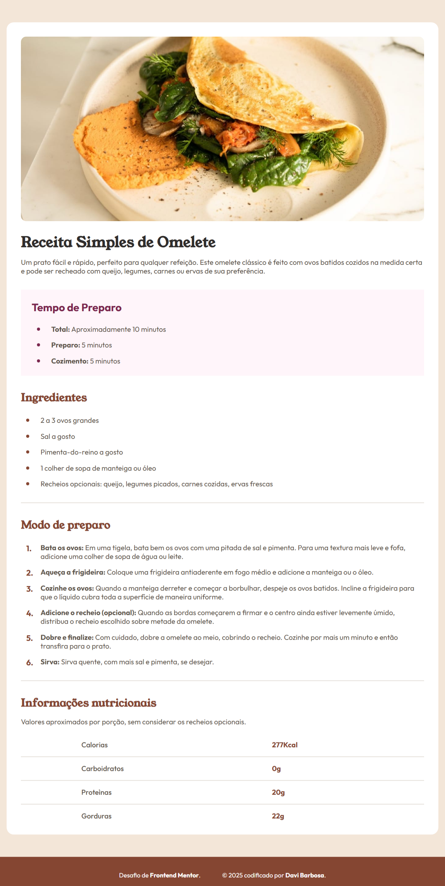

# Frontend Mentor - Solução da Página de Receita

Esta é uma solução para o [desafio da página de receita](https://www.frontendmentor.io/challenges/recipe-page-KiTsR8QQKm) no Frontend Mentor. Os desafios do Frontend Mentor ajudam você a melhorar suas habilidades de codificação construindo projetos realistas.

## Índice

-   [Visão Geral](#visão-geral)
-   [Captura de Tela](#captura-de-tela)
-   [Construído com](#construído-com)
-   [Autor](#autor)

## Visão Geral

Este projeto é uma página de receita de omelete, desenvolvida como parte do desafio do Frontend Mentor. O objetivo é praticar HTML e CSS semânticos, foco em responsividade e atenção aos detalhes visuais propostos pelo layout do desafio.

### A página apresenta:

-   Uma introdução visual da receita com imagem e descrição;
-   Seção destacando o tempo de preparo;
-   Lista de ingredientes e modo de preparo detalhado;
-   Tabela com informações nutricionais.

O layout foi construído com abordagem mobile-first e utiliza boas práticas de estruturação e organização CSS.

### Captura de Tela

### Construído com

-   HTML5 semântico
-   CSS
-   Metodologia Mobile-first

## Autor

-   Frontend Mentor - [@davibarbosadev](https://www.frontendmentor.io/profile/davibarbosadev)
