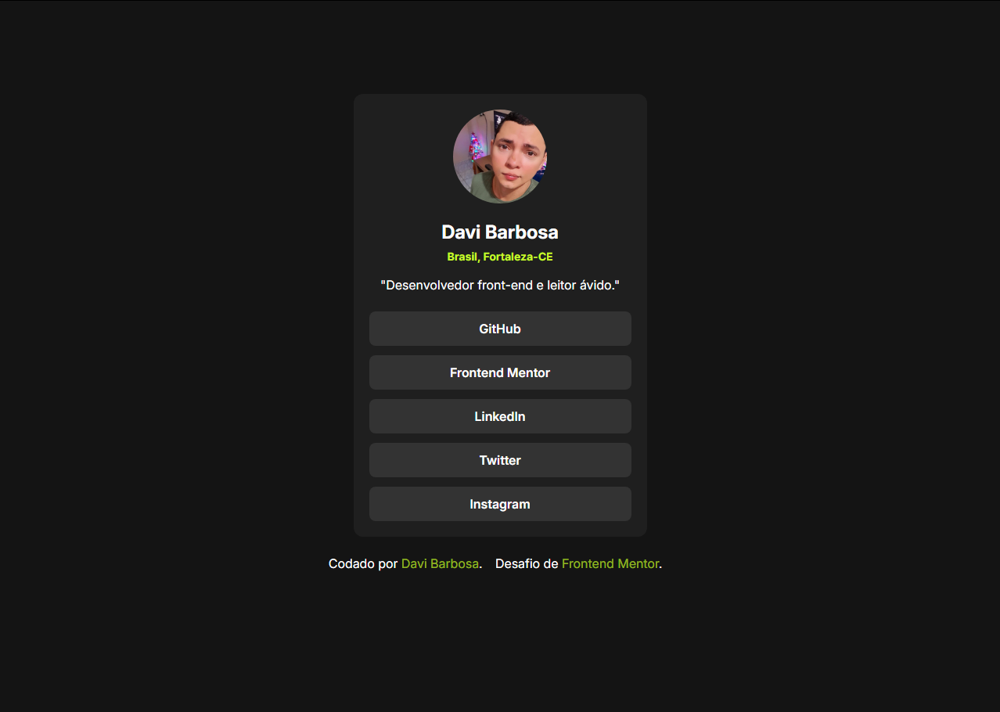

# Frontend Mentor - Solução de perfil de links sociais

Esta é uma solução para o [desafio de perfil de links sociais no Frontend Mentor](https://www.frontendmentor.io/challenges/social-links-profile-UG32l9m6dQ). Os desafios do Frontend Mentor ajudam você a aprimorar suas habilidades de programação por meio da criação de projetos realistas.

## Índice

-   [Visão Geral](#visão-geral)
-   [Captura de Tela](#captura-de-tela)
-   [Links](#links)
-   [Construído com](#construido-com)
-   [Author](#author)

## Visão Geral

Este projeto é um perfil de links sociais, desenvolvido como parte de um desafio do Frontend Mentor. O principal objetivo é praticar a construção de layouts simples com HTML e CSS, reforçando conceitos de responsividade, semântica e organização visual.

### A página apresenta:

-   Um cartão de perfil com:
-   Foto de perfil;
-   Nome, localização e uma breve descrição;
-   Lista de links para redes sociais;
-   Rodapé com atribuições ao autor e ao desafio do Frontend Mentor.

O layout foi criado com uma abordagem mobile-first e segue boas práticas de marcação semântica e organização do CSS.

### Captura de Tela

### Links

-   Live Site URL: [Add live site URL here](https://your-live-site-url.com)

### Construído com:

-   Semantic HTML5 markup
-   CSS custom properties
-   Flexbox
-   Mobile-first workflow

## Autor

-   Website - [Add your name here](https://www.your-site.com)
-   Frontend Mentor - [@davibarbosadev](https://www.frontendmentor.io/profile/davibarbosadev)
